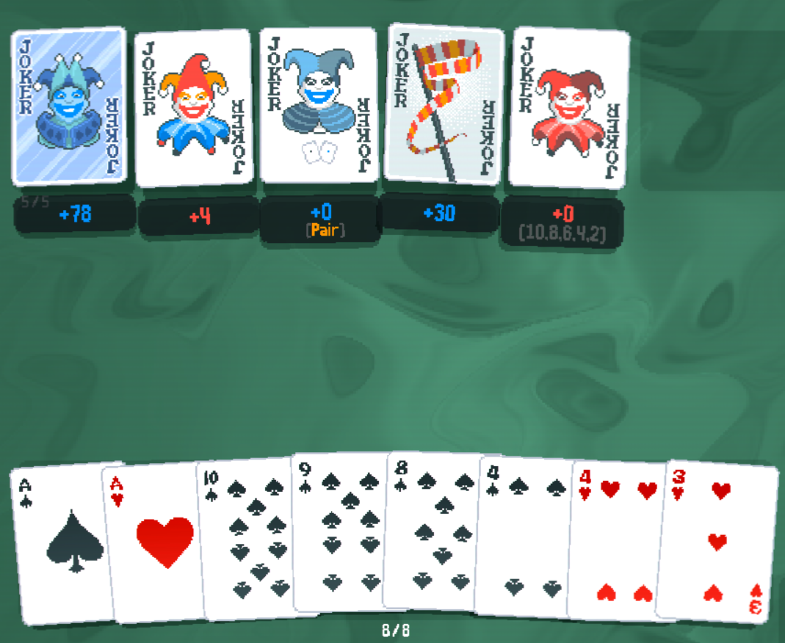
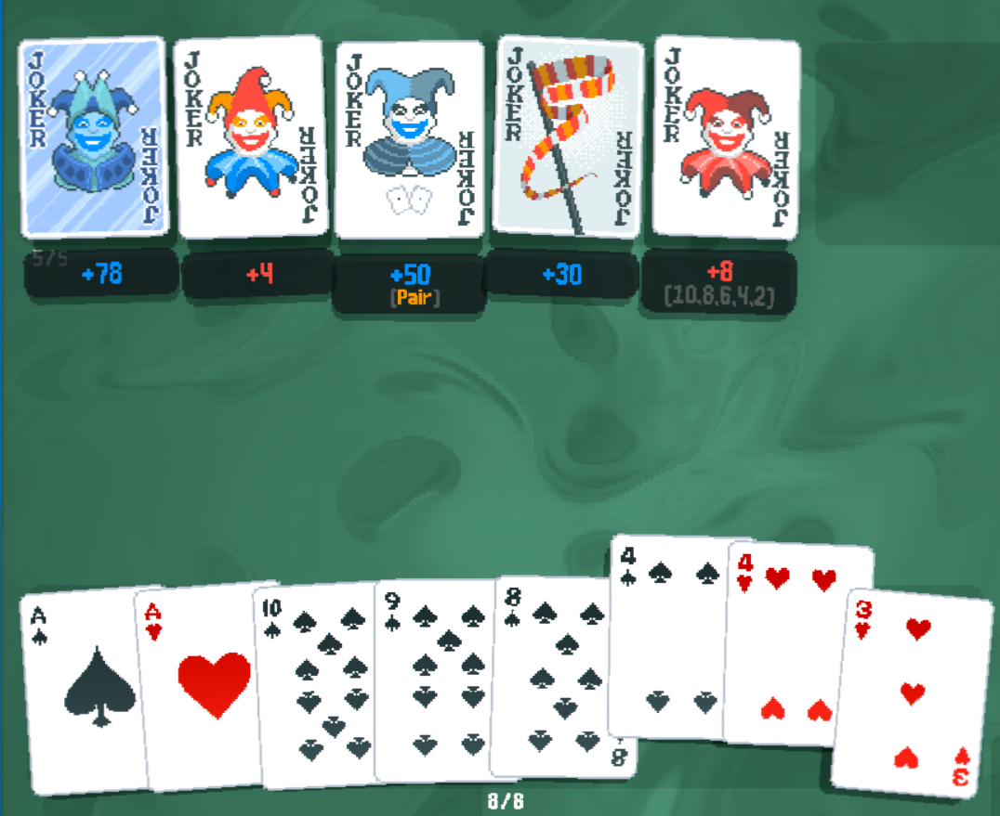
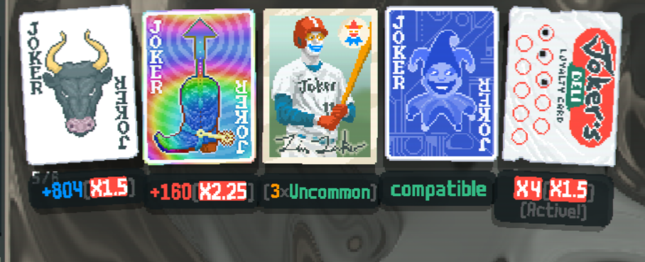
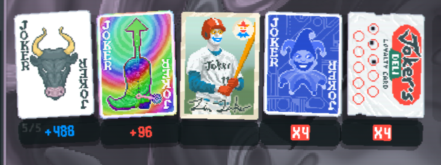

# JokerDisplay for Balatro

Balatro mod that displays information such as modifiers or relevant hands, ranks or suits under Jokers.

## Installation

1. Install [Steamodded](https://github.com/Steamopollys/Steamodded) [(version >1.0.0)](https://github.com/Steamodded/smods/wiki)
2. Download the [latest release](https://github.com/nh6574/JokerDisplay/releases)
3. Extract the zip file into its own folder inside your Balatro mods folder (%appdata%\Balatro\Mods)

## Usage

* Right-click the display or a Joker to hide/unhide displays (or use the back button on your controller over a Joker). This will disable all calculations for that joker (in case of crashes).
* Left-click the display to collapse/expand extra rows of text. (or use the up button on your controller over a Joker).
* Go to Mods > JokerDisplay > Config for more options.

Feel free to [open an issue](https://github.com/nh6574/JokerDisplay/issues) for suggestions or bug reports.

## Screenshots

## Mod Support

This mod only supports vanilla jokers but you can add support for it in your own mod by defining how the display should look.

Check out the [wiki](https://github.com/nh6574/JokerDisplay/wiki) for API documentation.

## Contributing

This mod will probably not get any new features after 1.8, so please feel free to fork or do PRs if you feel like you can improve on this or fix any issues!

Also I would appreciate if people contact me when there are updates to the game or Steamodded that break any features or add content.

### Acknowledgements

Special thanks to Eremel and OppositeWolf770 for the help!

And thank you to WholeHorse for the Russian localization and SDM0 for the French localization!

## Contact

If you have any issues feel free to contact me on [Twitter](https://nh6574.com/), [Bluesky](https://bsky.app/profile/nh6574.com) or Discord as nh6574

And here's my [ko-fi link](https://ko-fi.com/nh6574) if you feel especially grateful.
